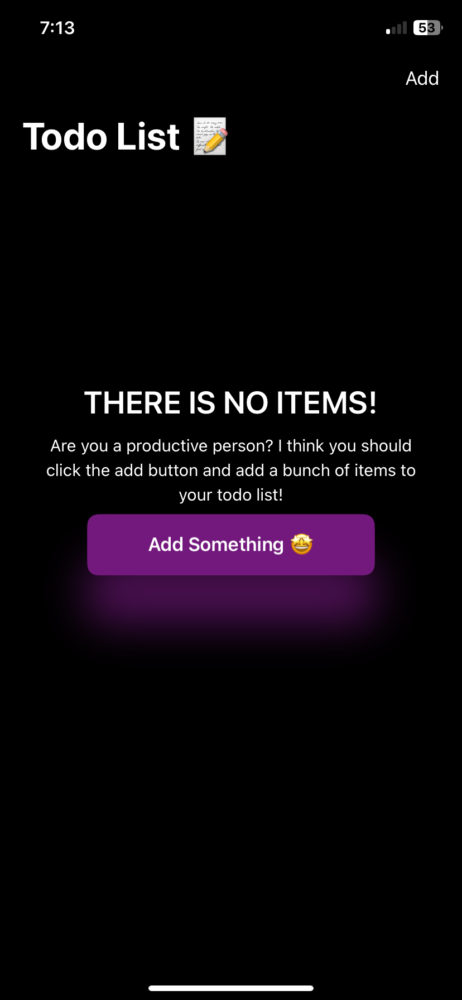
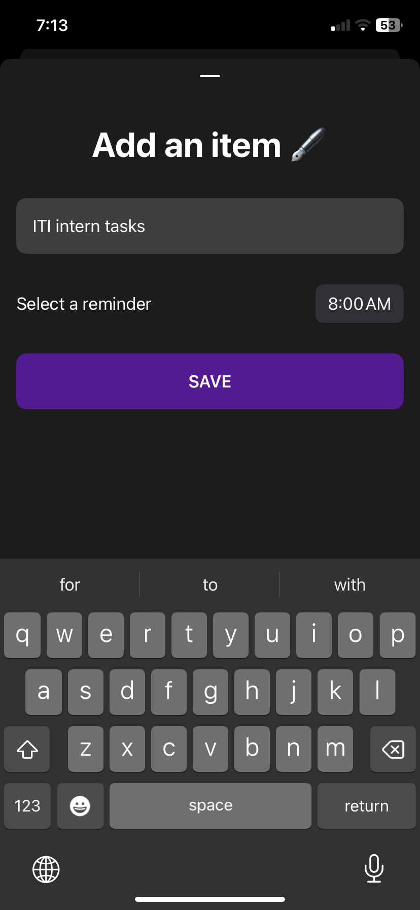
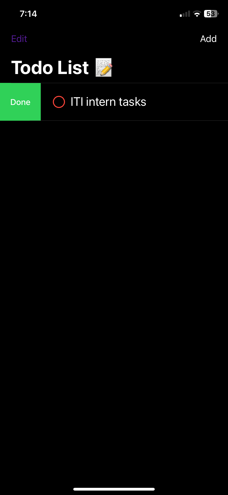
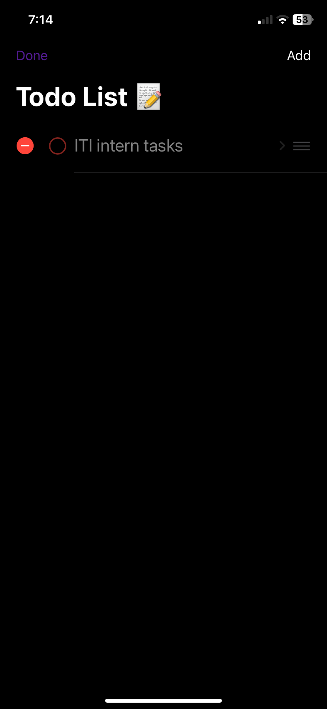
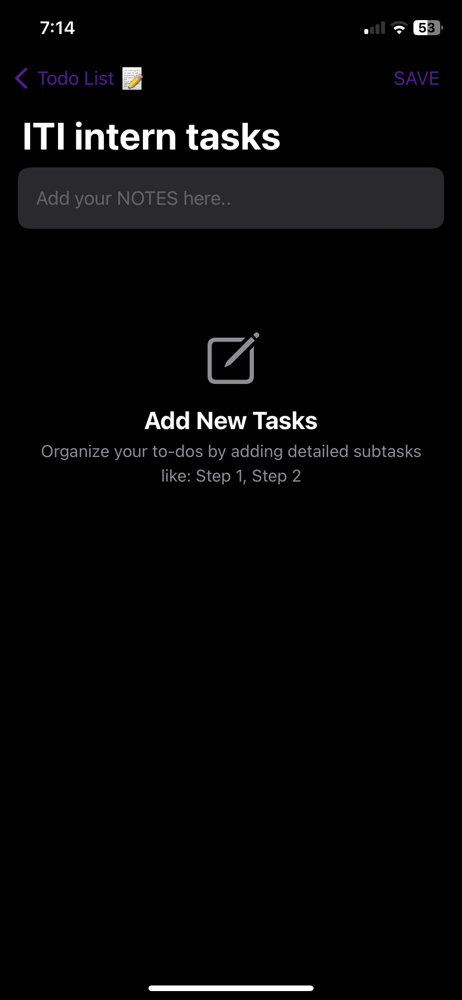
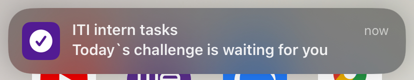

# Task-Nest

## Overview
This is a SwiftUI-based To-Do List app that helps you manage your tasks efficiently.
The app allows you to add tasks and subtasks,
delete tasks and update them as completed or not completed,
set reminders with notifications,
and enjoy smooth animations.

## Features
- **Add Tasks**: Create tasks with ease.
- **Add Subtasks**: Break down tasks into smaller, manageable subtasks.
- **Notification Manager**: Set reminders for tasks at specific times.
- **Animations**: Enjoy a visually appealing user interface with smooth animations.

## Screenshots

  
  

  <em>Main screen "NoItems."</em> &nbsp;&nbsp;&nbsp;&nbsp;&nbsp;&nbsp;&nbsp;&nbsp;
  <em>Add item screen</em>

  
  

  <em>Swipe action "Done"</em> &nbsp;&nbsp;&nbsp;&nbsp;&nbsp;&nbsp;&nbsp;&nbsp;
  <em>Edit button functionality</em>

  
  

  <em>Add subtasks Screen "NoItems."</em> &nbsp;&nbsp;&nbsp;&nbsp;&nbsp;&nbsp;&nbsp;&nbsp;
  <em>Notification</em>

## Usage
1. **Add a Task**: Tap the "Add Task" button to create a new task.
2. **Add Subtasks**: Within a task, tap "Add Subtask" to break down the task further.
3. **Set Notifications**: Choose a specific time for the app to remind you of your task.
4. **Enjoy Animations**: Experience smooth animations as you interact with the app.

## Contact
For any inquiries, feel free to reach out to [Abedelrahman Atallah](aratallah3@gmail.com).
